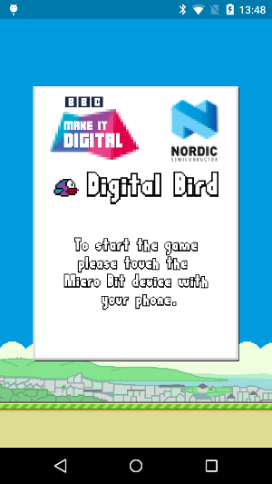
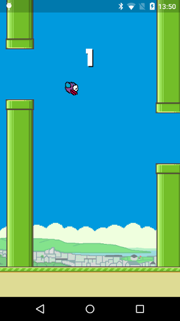

#Digital Bird

The Digital Bird is a simple Android game created as a part of the BBC Make it Digital program to teach children embedded programming for Bluetooth Smart. The game requires a Bluetooth Smart device with the remote control application flashed on it in order to play. The documentation of the application may be found below.

###Screenshots

 

###Requirements

- An Android phone or tablet with the Android version 4.3 or newer, with Bluetooth Smart support,
- A Bluetooth Smart device with a possibility to flash a new application,
- Programming setup (USB programmer or DFU - Device Firmware Update)

###Remote control specification

1. The device MUST be Bluetooth 4.0 compatible.
2. The remote control MUST advertise with the following service UUID in the Complete List of 128-bit Service Class UUIDs field: `88400001-e95a-844e-c53f-fbec32ed5e54` in order to be found. See [here](https://www.bluetooth.org/en-us/specification/assigned-numbers/generic-access-profile) for details about the Generic Access Profile assigned numbers.
3. The device MUST have this service in he Attribute database.
4. The service must have a characteristic with the UUID: `88400002-e95a-844e-c53f-fbec32ed5e54` with the NOTIFY property. The characteristic must have the Client Characteristic Configuration Descriptor (CCCD) to enable or disable notifications.
5. The connection interval SHOULD be configured to be approximately 20 milliseconds or less in order to get smooth gaming experience.
6. When notifications enabled the device MUST send a notification with value `0x01` (1 byte) whenever the button is pressed. It MAY send a notification with the value `0x00` (or other) when the button has been released.
7. The application will connect the the remote control if it is advertising with the service UUID as describe above, and the RSSI of the signal is higher than -35 dBm, which means that devices should be close to each other.

 
